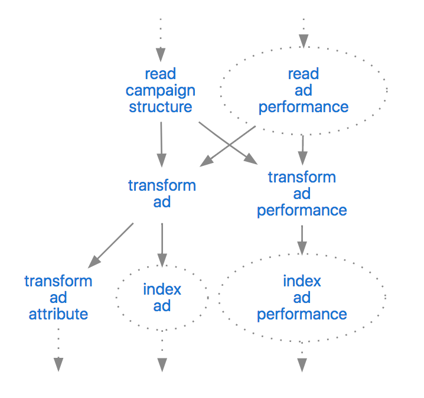
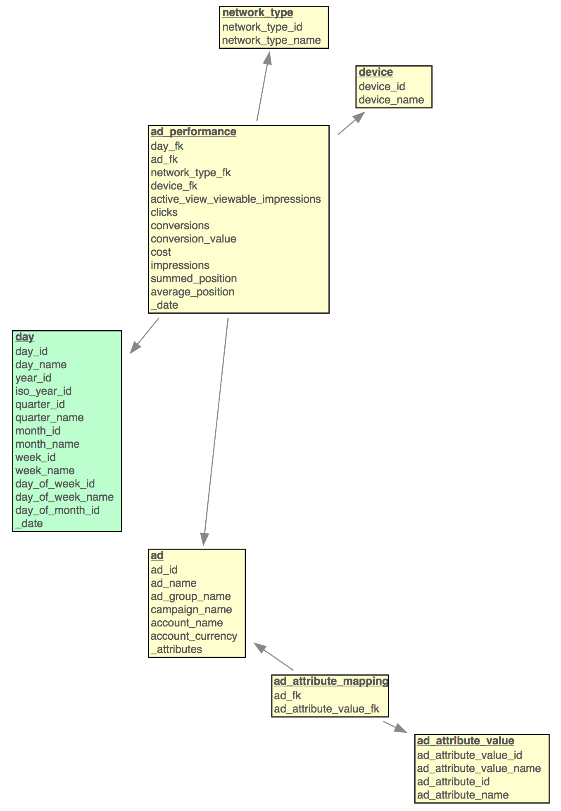

# Google Ads Performance Pipeline

A small [mara data integration pipeline](https://github.com/mara/data-integration) that incrementally loads the files downloaded by the [mara Google ads performance downloader](https://github.com/mara/google-ads-performance-downloader) into a PostgreSQL data warehouse and transforms the data into a dimensional schema.




## Resulting data

The pipeline (defined in [google_ads_performance_pipeline/__init__.py](google_ads_performance_pipeline/__init__.py)) creates a database schema `gads_dim` that contains an `ad_performance` fact table with the dimensions `time`, `ad`,`network_type`, and `device`:

 

&nbsp;

This is an example row of the fact table:

```sql
select * from gads_dim.ad_performance where conversions > 0 order by random() limit 1;
-[ RECORD 1 ]--------------------+-------------
day_fk                           | 20180907
ad_fk                            | 165125527334
network_type_fk                  | 3
device_fk                        | 2
active_view_viewable_impressions | 
clicks                           | 6
conversions                      | 1
conversion_value                 | 125.88
cost                             | 2.81
impressions                      | 85
summed_position                  | 161.5
average_position                 | 1.9
_date                            | 2018-09-07
```

See [Ad Performance Report](https://developers.google.com/adwords/api/docs/appendix/reports/ad-performance-report) for a documentation of the metrics.

The fields `conversion_value` and `cost` are converted to euro using daily exhange rates from the ECB.


## Getting started

Add 

```
-e git+git@github.com:mara/google-ads-performance-pipeline.git@1.0.0#egg=google_ads_performance_pipeline
```

to the `requirements.txt` of your mara project. See the [mara example project](https://github.com/mara/mara-example-project) for details.
 
 Make sure that your ETL contains the [etl_tools/create_time_dimensions/](https://github.com/mara/etl-tools/blob/master/etl_tools/create_time_dimensions/__init__.py)and [etl_tools/load_euro_exchange_rates](https://github.com/mara/etl-tools/tree/master/etl_tools/load_euro_exchange_rates/__init__.py) pipelines for creating the `time.day` dimension and for loading exchange rates.

Then add the pipeline to your ETL with

```python
import google_ads_performance_pipeline

# ..

my_pipeline.add(google_ads_performance_pipeline.pipeline)
```


